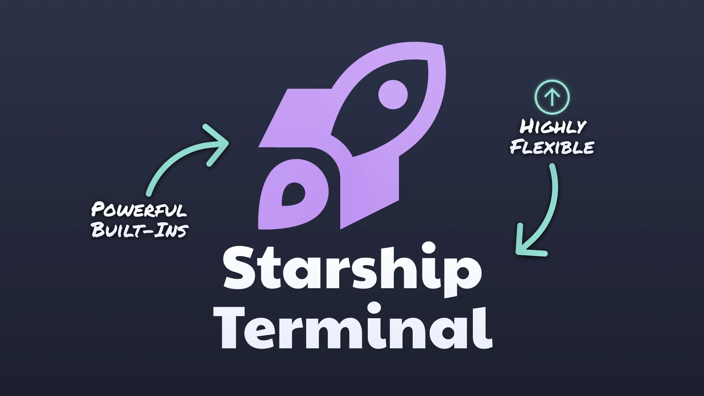

   # Starship

Okay, imagine you’re a space explorer navigating the wild corners of the internet, searching for the perfect tool for your terminal. And suddenly… boom! **Starship** appears—a tool that brings a smile to your face faster than the cats from https://http.cat/. But before you set off to conquer the file system, sit by the campfire for a moment and listen to what this thing is and why it’s worth considering on your programming odyssey.

### What is Starship?

Imagine a terminal that’s so fast that before you even think about what you want to type, it’s already ready to respond. **Starship** https://starship.rs/ is a minimalist and lightning-fast **shell prompt** written in **Rust**. It’s like your favorite cup of coffee—minimalist, yet packing a punch. And it works everywhere: in **Bash**, **Zsh**, **Fish**, **PowerShell**, and even on systems like Linux, macOS, and Windows.

Developers love it for being as lightweight as a backpack on a day hike, yet full of possibilities like a tent pitched on a mountain top.



### What are the advantages of Starship?

### 1. **Cosmic Speed**

Let’s be honest—developers love when things happen instantly. Starship is so fast that even The Flash might blush. It’s all thanks to **Rust**, powering this prompt to galactic speeds.

### 2. **Minimalism**

Nothing is more exhausting than a terminal that looks like a Christmas tree with an overload of information. Starship shows only what’s really needed. Are you in a **Git** repository? The branch and status will appear. Using **Node.js**? It’ll show the version. Simple, tidy, and aesthetic.

### 3. **Flexibility Like a Yoga Mat**

Want to customize every detail? You have full control over the configuration in a single file—`starship.toml`. Colors, symbols, information—you can adjust everything. Even successes and errors can look just how you like them, e.g., green “➜” for success, red “➜” for errors.

### 4. **Works Everywhere**

Whether it’s **Bash**, **Zsh**, or **Fish**—Starship works like a chameleon, adapting to every shell. And if you migrate from one system to another, Starship will still be by your side, ready to run on Linux, macOS, and Windows.


### Disadvantages? Hmm…

Okay, not everything is perfect. There are a few things that might irritate you, but as a nomadic programmer, you’re ready for it, right?

- **Configuration file**: While the setup is straightforward, the number of possibilities might overwhelm you. It’s a bit like a treasure map—lots of paths, and you need to find the one that leads to gold.
- **No native GUI**: If you’re hoping for colorful windows for configuration, well, you’ll have to learn to love `.toml` files.

### Installing Starship

Now, time for some magic! Starship doesn’t install itself, but it’s really simple.

1. **Grab your terminal, take a deep breath, and type**:

    ```bash
    
    curl -sS https://starship.rs/install.sh | sh
    
    ```

   You’ve just summoned Starship to your system. Well done, nomad!

2. **Tell your shell that Starship is your new prompt**:

   For **Bash**:

    ```bash
    
    echo 'eval "$(starship init bash)"' >> ~/.bashrc
    source ~/.bashrc
    
    ```

   For **Zsh**:

    ```bash
    
    echo 'eval "$(starship init zsh)"' >> ~/.zshrc
    source ~/.zshrc
    
    ```

3. **Customize it for yourself**:
   Want your terminal to look cosmic? Open the config file:

    ```bash
    
    mkdir -p ~/.config && touch ~/.config/starship.toml
    
    ```

   And then adjust it however you like! You have full freedom.


### Configuration – Where the Treasure Lies

Remember, you’re in control of your terminal. Starship is just a tool, but you decide how it looks. Here’s an example configuration you might like:

```toml

# Disable extra newline after every command
add_newline = false

# Arrow style
[character]
success_symbol = "[➜](bold green)"
error_symbol = "[➜](bold red)"

# Disable package display (why clutter the terminal?)
[package]
disabled = true

```

With a setup like this, you’ll feel like a true space traveler, with your terminal showing only what’s important.

### Let’s keep moving…

Onward through the digital universe, with a cup of coffee in hand and Starship in the terminal! Once you’ve installed your cosmic companion and tweaked your first config file, it’s time to dive deeper into the boundless horizons of customization and daily hacks that make a programmer’s life much simpler. Get ready for a handful of neat tricks and tips!

### How to Customize Starship to Look Like a Dream?

Nobody likes defaults, right? Every true digital nomad craves customization. Your Starship setup can be modest, but it can also shoot for the stars with dozens of modules. After all, it’s all about making your tool as unique as you are!

### Colors Like a Neon City

In the programming world, colors are like signposts in the dark alleys of debugging. Starship lets you take control of every pixel displayed in the terminal.

You can add an explosion of colors to your prompt, as if you’ve just landed at a neon space station in a cyberpunk future:

```toml

[git_branch]
symbol = "🌵 "  # Why not a cactus?
style = "bold yellow"  # Bold and yellow like the desert sun

```

Now, whenever you’re on a Git branch, this delightful cactus icon will remind you that even in dry coding spells, there’s life to be found!

### More Modules Than Gadgets in Your Backpack

Don’t limit yourself to just the basics—Starship lets you add modules that show practically everything, from your programming language version to your SSH session status. And since you’re a nomadic programmer, it’s worth having all the important info at your fingertips. Here are a few useful modules you might want to add to your setup:

```toml

# Node.js version, because front-end is life
[nodejs]
symbol = "⬢ "  # The classic Node symbol
style = "bold green"

```

```toml

# Your SSH session status – who doesn’t love remote coding on a server?
[ssh]
symbol = "🛸 "  # A spaceship, why not?
style = "bold blue"

```

Now, whenever you log into a remote server, you’ll know you’re on board a spaceship, steering towards new coding adventures!


### Productivity at Warp Speed

You know what’s the best part about Starship? It makes everyday terminal tasks more enjoyable and faster. Here are some tricks that’ll make you feel like the pilot of a spaceship with everything under control.

### A Prompt That Tells You Everything

Ever feel like your prompts are missing info but also too cluttered? Starship strikes the perfect balance. Instead of typing a million commands to check software versions, the current Git branch status, or even disk space, Starship shows you everything right in the prompt.

```toml

[disk_space]
threshold = "10GB"  # Oh, I’m running out of space on my portable rocket!
symbol = "🛑 "
style = "bold red"

```

Now, when your disks start filling up like a travel bag before a long trip, Starship will warn you right in the terminal. It’s like having your own onboard robot!

### Veteran Tips and Tricks

As a new traveler on the Starship path, here are a few things to keep in mind:

1. **Minimalism is key** – Starship is fast because it doesn’t try to do everything at once. Keep your settings simple and concise, and you’ll really feel the power of this tool.
2. **Be mindful of your configuration** – Sometimes less is more. When you clutter your prompt with too much information, simplicity disappears. Starship is all about giving you the essentials without unnecessary decorations.
3. **Always with you** – As you wander across different operating systems, Starship will always be loyal like the best companion. Don’t worry about compatibility—it works on everything from **Linux Mint** to **macOS** and even Windows.

### Conclusion

To sum up, Starship is a tool for any programmer who values speed, elegance, and control over their terminal. It’s like a mobile companion, always ready for action, and it doesn’t just look cool—it gives you superpowers with instant information about your system and projects. Installation is easy, and customization is as flexible as your future plans.

So keep wandering through the digital wilderness, with a terminal shining like the stars in distant galaxies, and remember—**Starship** will always be ready to help you in any situation.

Now… time to fire up the engines and embark on more coding adventures! 🚀


