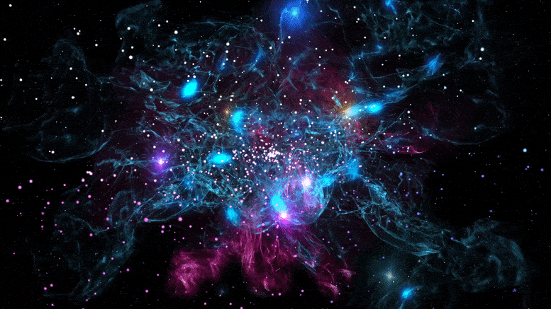

# Cosmic Tunnel

### **Cosmic Tunnel — tutorial, from Scratch to Cyber Delight**

Hey, cyber-programming warriors! Today, we're diving into the world of **Cosmic Tunnel** with Three.js, and I'll guide you through every step. Get ready for some serious coding because this project is worth immersing yourself in down to the last LED diode.

---

### **Requirements:**

- **Three.js** – the main library for rendering 3D in the browser.
- **Post-processing** – UnrealBloomPass for glowing effects.
- Basic knowledge of JavaScript and Three.js.
- Adding a Spline.js file.
- Lots of coffee and a readiness for adventure!

---


### **Creating the Scene**

Let's start with the basics — creating the scene, camera, and renderer. The scene is your 3D canvas, and the camera observes it from a specific point.

```jsx

const w = window.innerWidth;
const h = window.innerHeight;
const scene = new THREE.Scene();
scene.fog = new THREE.FogExp2(0x000000, 0.3);
const camera= new THREE.PerspectiveCamera(75, w/h, 0.1, 1000);
// Camera positioning — moving it back a bit to see the tunnel
camera.position.z = 5;
const renderer = new THREE.WebGLRenderer();
renderer.setSize(w,h);
renderer.toneMapping = THREE.ACESFilmicToneMapping;
renderer.outputColorSpace = THREE.SRGBColorSpace;
document.body.appendChild(renderer.domElement);
```

**What's happening here?**

- We're creating a **scene** where we'll render 3D objects.
- A camera with a 75-degree field of view is placed to observe our tunnel.
- The renderer brings everything to life in the browser.

---

### **Adding OrbitControls**

To make navigating your cosmic tunnel even more interactive, we'll add **OrbitControls**. This allows you to control the camera with mouse movements, giving you the freedom to explore the tunnel from different angles.

```js
const controls= new OrbitControls(camera,renderer.domElement);
controls.enableDamping= true;
controls.dampingFactor= 0.03;
```

**What’s happening here?**

- **OrbitControls** is imported and instantiated to enable mouse interaction with the camera.
- You can configure various properties like damping and zoom speed to customize the controls' behavior.
- **controls.update()** is called in the animation loop to ensure the controls reflect user input each frame

### **Spline and TubeGeometry — Twisted Geometry**

It's time to create the tunnel. We'll use **CatmullRomCurve3** to generate a curved path and then generate **TubeGeometry** based on it.

```jsx

// Generating TubeGeometry based on the spline
const tubeGeo =new THREE.TubeGeometry(spline, 222, 0.65, 16, true);
const edges = new THREE.EdgesGeometry(tubeGeo, 1);
const lineMat = new THREE.LineBasicMaterial({ color:"#00ffff" });
const tubeLines = new THREE.LineSegments(edges, lineMat);
scene.add(tubeLines);

// Creating material and mesh for the tunnel
const points= spline.getPoints(100);
const geometry = new THREE.BufferGeometry().setFromPoints(points);
const material = new THREE.LineBasicMaterial({color: "#39ff14"});
const line = new THREE.Line(geometry, material);
//scene.add(line);

const tubeMat= new THREE.MeshBasicMaterial({
    color: 0x0099ff,
    //side:THREE.DoubleSide,
    wireframe:true,
});
const tube= new THREE.Mesh(tubeGeo,tubeMat);
scene.add(tube);

```

**Explanation:**

- We're creating a spline based on several points, giving us a curved path.
- **TubeGeometry** wraps around the spline, creating our tunnel.
- **MeshBasicMaterial** with wireframe enabled, so we can see the edges of the tunnel as if drawn by lasers.

---

### **Importing Three.js and Creating the Curve (CatmullRomCurve3)**

First, we need to import Three.js and prepare the curve based on a set of points:

```jsx

import * as THREE from 'three';

const curvePath = [10.136184463414924, -1.374508746897471, 10.384881573913269,
    9.1152593889854714, -1.374508746897471, 8.5846792797570011,
    9.0669355709754882, -1.0665123466336568, 5.8937771631608156,
    10.151040177840205, -0.65913653144937956, 3.4340491740541346,
    10.806779203170416, 1.8859391007298545, 0.46855774212986023,
    10.761433540147586, 2.8724172201359197, -1.2811838605587311,
    9.6195923104445065, 2.8724172201359197, -3.2833099941904766,
    6.9763020889151646, 2.7659257976905427, -4.7591958908830172,
    6.0461277891353697, 1.0727045302089879, -6.6638740164090482,
    7.3472235778544794, -1.8228856326635698, -9.0685043046185623,
    7.226367212900791, -1.8228856326635698, -10.499536640855691,
    5.8354566696263914, -1.8228856326635698, -12.039219379199908,
    3.6532357452141353, -0.20463983570573391, -13.87695442281038,
    -0.30169589630131455, 1.5965000671484342, -14.879986418947327,
    -2.8925694230502157, 2.2971364614427481, -13.892095587598131,
    -4.537672295357936, 4.5863515759659208, -12.140831652074551,
    -6.1287913464117594, 5.9653814634119815, -8.9776527318875896,
    -6.0120301606452813, 4.4081161943855998, -6.712084358394045,
    -5.2138252159038974, 2.820894808418279, -4.4532820412085607,
    -2.3424712835109611, 2.2032065005086259, -3.0788773693500198,
    -0.0076956453915433265, 1.8931797788880202, -1.6577070662471063,
    -0.24767503988481437, 2.8845808465856684, 0.073915859214221724,
    -2.2174044353598896, 4.2415524507318576, 2.215992718290742,
    -3.4526531678364756, 3.0615192023340851, 4.7922404932096558,
    -3.7356278971556445, 1.4054080369354316, 7.8432021841434629,
    -3.4003734463804118, 1.1924069108769393, 9.2464090886227073,
    -1.8851803760476225, 1.5269331003449989, 10.306083896408374,
    0.01071077144031829, 2.1101821577522295, 10.490880699847727,
    0.42562058195647001, 2.2759939598834387, 11.613129436580291,
    0.096405262182225115, 0.032317784084054391, 16.223455375061565,
    2.3458797884520433, 0.38907275257695584, 19.91188266079584,
    5.7018400098488771, 1.73337964747396, 20.615481586999959,
    7.9720939736751824, 1.73337964747396, 19.303399329816457,
    9.8672362721095652, 0.090083018057025177, 16.893338541618121,
    11.225959519544134, -1.374508746897471, 14.279002555560753,
    11.288646925965876, -1.374508746897471, 11.926359497447137,
    10.136184463414924, -1.374508746897471, 10.384881573913269
];

const points =[];
const len = curvePath.length;
for  (let p=0 ;p < len; p+=3 ){
    points.push(new THREE.Vector3(
        curvePath[p],
        curvePath[p+1],
        curvePath[p+2]
    ));

}

const spline = new THREE.CatmullRomCurve3(points);
export default spline;
```

---

### **Floating Boxes**

What's a cosmic tunnel without mysterious floating objects? Let's make some simple, rotating boxes that will travel through the tunnel.

```jsx

const numBoxes = 55;
const size= 0.075;
const boxGeo = new THREE.BoxGeometry(size, size , size);
for (let i=0; i< numBoxes; i+=1) {
    const boxMat= new THREE.MeshBasicMaterial({
        color: "#39ff14",
        wireframe: true,
    });
    const box = new THREE.Mesh(boxGeo,boxMat);
    const p =( i/numBoxes + Math.random() * 0.1) % 1;
    const pos = tubeGeo.parameters.path.getPointAt(p);
    pos.x += Math.random() -0.4;
    pos.z += Math.random() -0.4;
    box.position.copy(pos);
    const rote = new THREE.Vector3(
            Math.random() * Math.PI,
            Math.random() * Math.PI,
            Math.random() * Math.PI,
    );

    box.rotation.set(rote.x, rote.y, rote.z);
    const edges = new THREE.EdgesGeometry(boxGeo, 0.2);
     const color = new THREE.Color().setHSL(0.7 - p, 1, 0.5);
    const lineMat = new THREE.LineBasicMaterial({ color})
    const boxLines = new THREE.LineSegments(edges, lineMat);
    boxLines.position.copy(pos);
    boxLines.rotation.set(rote.x, rote.y, rote.z);
    //scene.add(box);
    scene.add(boxLines);}

```

---

### **Post-Processing Glow Effect**

Now let's add **UnrealBloomPass** for that wow-effect to make everything glow and pulse.

```jsx

const renderScene=  new RenderPass(scene,camera);
const bloomPass = new UnrealBloomPass(new THREE.Vector2(w,h) ,1.5,0.4,1 )
bloomPass.threshold= 0.002;
bloomPass.strength = 3.5;
bloomPass.radius = 0;
const composer = new EffectComposer(renderer);
composer.addPass(renderScene);
composer.addPass(bloomPass);

```

---

### **Camera Movement Through the Tunnel**

Before we animate everything, we need to make the camera fly through the tunnel. We'll use the same curve we built earlier.

```jsx

function updateCamera(t) {
    const time = t * 0.1;
    const looptime = 10 * 1000;
    const p = (time % looptime) / looptime;
    const pos = tubeGeo.parameters.path.getPointAt(p);
    const lookAt = tubeGeo.parameters.path.getPointAt((p + 0.03) % 1);
    camera.position.copy(pos);
    camera.lookAt(lookAt);
}

```

---

### **Animation and Rendering**

The final element — animation. We need to put it all together and run the render loop.

```jsx

function animate(t=0){
    requestAnimationFrame(animate)
    updateCamera(t)
    composer.render(scene,camera);
    controls.update();
}
animate()

function handleWindowRise(){
    camera.aspect= window.innerWidth/window.innerHeight;
    camera.updateProjectionMatrix();
    renderer.setSize(window.innerWidth, window.innerHeight);
}
window.addEventListener('resize',handleWindowRise,false);

```

---

### Your Cosmic Tunnel should look like this:

main.js

```js
import * as THREE from 'three';
import {OrbitControls} from 'three/examples/jsm/controls/OrbitControls.js';
import spline from './spline.js'
import { EffectComposer } from "three/examples/jsm/postprocessing/EffectComposer.js";
import { RenderPass } from "three/examples/jsm/postprocessing/RenderPass.js";
import { UnrealBloomPass } from "three/examples/jsm/postprocessing/UnrealBloomPass.js";

const w= window.innerWidth;
const h = window.innerHeight;
const scene = new THREE.Scene();
scene.fog = new THREE.FogExp2(0x000000, 0.3);
const camera= new THREE.PerspectiveCamera(75, w/h, 0.1, 1000);
camera.position.z =5;
const renderer= new THREE.WebGLRenderer();
renderer.setSize(w,h);
renderer.toneMapping = THREE.ACESFilmicToneMapping;
renderer.outputColorSpace =THREE.SRGBColorSpace;
document.body.appendChild(renderer.domElement);

const controls= new OrbitControls(camera,renderer.domElement);
controls.enableDamping= true;
controls.dampingFactor= 0.03;

const renderScene=  new RenderPass(scene,camera);
const bloomPass = new UnrealBloomPass(new THREE.Vector2(w,h) ,1.5,0.4,1 )
bloomPass.threshold= 0.002;
bloomPass.strength = 3.5;
bloomPass.radius = 0;
const composer = new EffectComposer(renderer);
composer.addPass(renderScene);
composer.addPass(bloomPass);


const tubeGeo =new THREE.TubeGeometry(spline, 222, 0.65, 16, true);
const edges = new THREE.EdgesGeometry(tubeGeo, 1);
const lineMat = new THREE.LineBasicMaterial({ color:"#00ffff" });
const tubeLines = new THREE.LineSegments(edges, lineMat);
scene.add(tubeLines);


const numBoxes = 55;
const size= 0.075;
const boxGeo = new THREE.BoxGeometry(size, size , size);
for (let i=0; i< numBoxes; i+=1) {
const boxMat= new THREE.MeshBasicMaterial({
color: "#39ff14",
wireframe: true,
});
const box = new THREE.Mesh(boxGeo,boxMat);
const p =( i/numBoxes + Math.random() * 0.1) % 1;
const pos = tubeGeo.parameters.path.getPointAt(p);
pos.x += Math.random() -0.4;
pos.z += Math.random() -0.4;
box.position.copy(pos);
const rote = new THREE.Vector3(
Math.random() * Math.PI,
Math.random() * Math.PI,
Math.random() * Math.PI,
);

    box.rotation.set(rote.x, rote.y, rote.z);
    const edges = new THREE.EdgesGeometry(boxGeo, 0.2);
     const color = new THREE.Color().setHSL(0.7 - p, 1, 0.5);
    const lineMat = new THREE.LineBasicMaterial({ color})
    const boxLines = new THREE.LineSegments(edges, lineMat);
    boxLines.position.copy(pos);
    boxLines.rotation.set(rote.x, rote.y, rote.z);
    //scene.add(box);
    scene.add(boxLines);


}

const points= spline.getPoints(100);
const geometry = new THREE.BufferGeometry().setFromPoints(points);
const material = new THREE.LineBasicMaterial({color: "#39ff14"});
const line = new THREE.Line(geometry, material);
//scene.add(line);


const tubeMat= new THREE.MeshBasicMaterial({
color: 0x0099ff,
//side:THREE.DoubleSide,
wireframe:true,
});


const tube= new THREE.Mesh(tubeGeo,tubeMat);
scene.add(tube);


const hemiLights = new  THREE.HemisphereLight(0xffffff, 0x444444,2 );
scene.add(hemiLights);


function updateCamera(t) {
const time = t * 0.1;
const looptime = 10 * 1000;
const p = (time % looptime) / looptime;
const pos = tubeGeo.parameters.path.getPointAt(p);
const lookAt = tubeGeo.parameters.path.getPointAt((p + 0.03) % 1);
camera.position.copy(pos);
camera.lookAt(lookAt);

}


function animate(t=0){
requestAnimationFrame(animate)
updateCamera(t)
composer.render(scene,camera);
controls.update();
}
animate()


function handleWindowRise(){
camera.aspect= window.innerWidth/window.innerHeight;
camera.updateProjectionMatrix();
renderer.setSize(window.innerWidth, window.innerHeight);
}
window.addEventListener('resize',handleWindowRise,false);
```


spline.js


```js
import * as THREE from 'three';

const curvePath = [10.136184463414924, -1.374508746897471, 10.384881573913269,
9.1152593889854714, -1.374508746897471, 8.5846792797570011,
9.0669355709754882, -1.0665123466336568, 5.8937771631608156,
10.151040177840205, -0.65913653144937956, 3.4340491740541346,
10.806779203170416, 1.8859391007298545, 0.46855774212986023,
10.761433540147586, 2.8724172201359197, -1.2811838605587311,
9.6195923104445065, 2.8724172201359197, -3.2833099941904766,
6.9763020889151646, 2.7659257976905427, -4.7591958908830172,
6.0461277891353697, 1.0727045302089879, -6.6638740164090482,
7.3472235778544794, -1.8228856326635698, -9.0685043046185623,
7.226367212900791, -1.8228856326635698, -10.499536640855691,
5.8354566696263914, -1.8228856326635698, -12.039219379199908,
3.6532357452141353, -0.20463983570573391, -13.87695442281038,
-0.30169589630131455, 1.5965000671484342, -14.879986418947327,
-2.8925694230502157, 2.2971364614427481, -13.892095587598131,
-4.537672295357936, 4.5863515759659208, -12.140831652074551,
-6.1287913464117594, 5.9653814634119815, -8.9776527318875896,
-6.0120301606452813, 4.4081161943855998, -6.712084358394045,
-5.2138252159038974, 2.820894808418279, -4.4532820412085607,
-2.3424712835109611, 2.2032065005086259, -3.0788773693500198,
-0.0076956453915433265, 1.8931797788880202, -1.6577070662471063,
-0.24767503988481437, 2.8845808465856684, 0.073915859214221724,
-2.2174044353598896, 4.2415524507318576, 2.215992718290742,
-3.4526531678364756, 3.0615192023340851, 4.7922404932096558,
-3.7356278971556445, 1.4054080369354316, 7.8432021841434629,
-3.4003734463804118, 1.1924069108769393, 9.2464090886227073,
-1.8851803760476225, 1.5269331003449989, 10.306083896408374,
0.01071077144031829, 2.1101821577522295, 10.490880699847727,
0.42562058195647001, 2.2759939598834387, 11.613129436580291,
0.096405262182225115, 0.032317784084054391, 16.223455375061565,
2.3458797884520433, 0.38907275257695584, 19.91188266079584,
5.7018400098488771, 1.73337964747396, 20.615481586999959,
7.9720939736751824, 1.73337964747396, 19.303399329816457,
9.8672362721095652, 0.090083018057025177, 16.893338541618121,
11.225959519544134, -1.374508746897471, 14.279002555560753,
11.288646925965876, -1.374508746897471, 11.926359497447137,
10.136184463414924, -1.374508746897471, 10.384881573913269
];

const points =[];
const len = curvePath.length;
for  (let p=0 ;p < len; p+=3 ){
points.push(new THREE.Vector3(
curvePath[p],
curvePath[p+1],
curvePath[p+2]
));

}

const spline = new THREE.CatmullRomCurve3(points);
export default spline;
```
### Awesome Cyber Effect

<video width="100%" height="500" controls>
  <source src="/assets/tunnel1.mp4" type="video/mp4">
</video>


### **Final Thoughts**

Now you have a fully functional **Cosmic Tunnel** that glows, pulses, and invites you to travel through other dimensions. Each step builds something unique — from geometry to floating objects to post-processing effects. You can now use this tunnel as a unique element on a website, a background for an app.

**Tip**: Feel free to modify the tunnel's appearance, add more objects, or adjust post-processing effects to fit your needs.

Ready for a cyber-journey through the cosmic tunnel? Dive into the code and create your own portal!