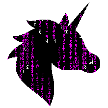
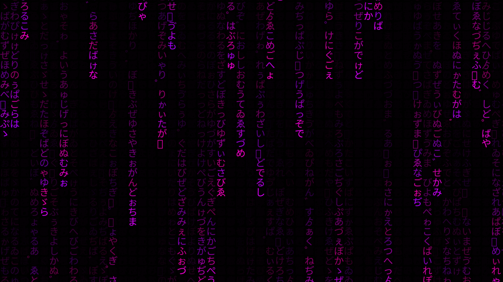
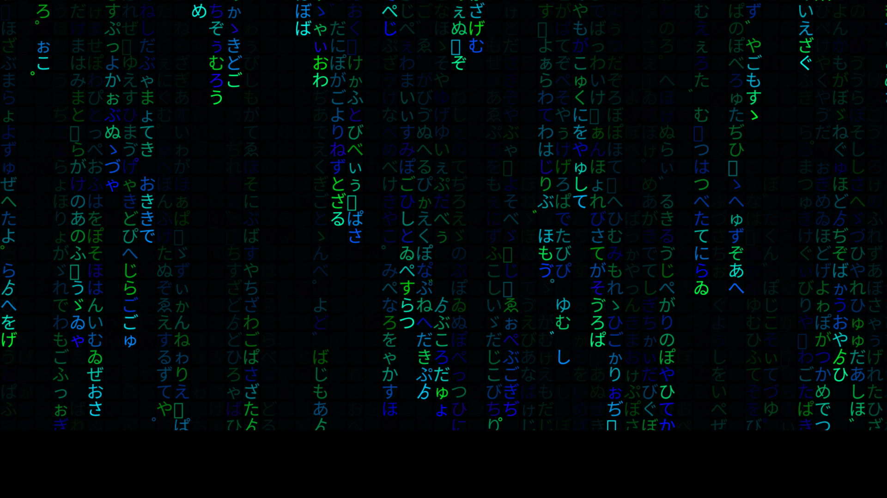

## The Tutorial to Creating Matrix Effect with TypeScript and Vite



### Introduction

Welcome to the Matrix... or at least, the TypeScript version of it! In this tutorial, we’ll guide you step by step to create a stunning Matrix-style falling characters effect using TypeScript and Vite. Don’t worry—it’s easier than dodging bullets in slow motion. So grab your virtual trench coat and sunglasses, and let’s dive into the code!

### Project Setup

Before we start coding, we need to set up our project. Open your terminal and follow these steps:

1. **Create a new Vite project**:

```bash
npm create vite@latest matrix-ts-vite -- --template vanilla-ts
cd matrix-ts-vite
```

2. **Install dependencies** (if needed):

```bash
npm install
```

3. **Start the development server**:

```bash
npm run dev
```

Now you have the basic structure ready, and the development server is running. We’re ready to “bend” some code!

### HTML Structure

Let’s start with the HTML file. We’ll keep it simple:

```html
<!doctype html>
<html lang="en">
  <head>
    <meta charset="UTF-8" />
    <meta name="viewport" content="width=device-width, initial-scale=1.0" />
    <title>Matrix Effect</title>
  </head>
  <body>
    <div id="app"></div>
    <script type="module" src="/src/main.ts"></script>
  </body>
</html>
```

No fluff, just the essentials—like a hacker’s lair. The `#app` div is where the magic will happen.

### Styling (CSS)

We need to ensure that our canvas is properly styled. Add this code to your `style.css` file:

```css
* {
    margin: 0;
    padding: 0;
}

body {
    background-color: #000;
}

canvas {
    display: block;
}
```

Black background? Check. Full-screen canvas? Check. Now we’re ready to initiate those iconic green or pink falling characters.

### The Matrix Code (TypeScript)

Now for the fun part! Open up `main.ts` and replace its contents with the following code:

```typescript
import './style.css'

document.querySelector<HTMLDivElement>('#app')!.innerHTML = `
  <canvas></canvas>
`;

const canvas = document.querySelector('canvas')!;
const ctx = canvas.getContext('2d')!;

canvas.width = window.innerWidth;
canvas.height = window.innerHeight;

const fontSize = 30;

function getCharactersFromRange(startCode: number, endCode: number): string[] {
    let characters: string[] = [];
    for (let i = startCode; i <= endCode; i++) {
        characters.push(String.fromCharCode(i));
    }
    return characters;
}

const startCode = 0x3040;
const endCode = 0x309f;

const characters = getCharactersFromRange(startCode, endCode);
console.log(characters);

const letters = characters;

const drops: number[] = [];
for (let i = 0; i < canvas.width / fontSize; i++) {
    drops[i] = 1;
}

function rand(min: number, max: number): number {
    return Math.floor(min + (max - min) * Math.random());
}

function getColor(): string {
    return 'hsl(' + rand(280, 320) + ',100%,50%)';
}

function draw() {
    ctx.fillStyle = 'rgba(0,0,0,0.1)';
    ctx.fillRect(0, 0, canvas.width, canvas.height);
    for (let i = 0; i < drops.length; i++) {
        const letter = letters[Math.floor(Math.random() * letters.length)];
        ctx.fillStyle = getColor();
        ctx.font = '30px monospace';
        ctx.fillText(letter, fontSize * i, fontSize * drops[i]);

        drops[i]++;

        if (drops[i] > canvas.height / fontSize && Math.random() > 0.95) {
            drops[i] = 0;
        }
    }
}
setInterval(draw, 33);
```





### What’s Happening Here?

- **Canvas Initialization**: We start by grabbing a reference to the `<canvas>` element and setting its width and height to match the browser window.
- **Character Generation**: The `getCharactersFromRange` function generates a list of characters from the Unicode range 0x3040 to 0x309F. These are Japanese Hiragana characters, which fit the Matrix theme perfectly.
- **Drops Array**: This array controls the vertical positions of the characters. Each element in the array represents a column of characters, and its value represents the Y position of the latest character drop.
- **Random Colors**: To make things more interesting, the `getColor` function generates random colors for the characters.
- **Drawing Function**: The `draw` function is where the magic happens. It clears a bit of the canvas with a semi-transparent black rectangle, then draws the characters in the next position down the screen. When a drop reaches the bottom, it randomly resets to the top.

### Running the Project

Once you’ve added the code, your development server should automatically refresh, and you’ll see the Matrix effect in action! If not, make sure everything is saved and check your terminal for errors.

### Conclusion

And there you have it—a Matrix-style falling characters effect created using TypeScript and Vite. It’s a fun project that touches on some core concepts like canvas manipulation, character generation, and basic animation.

Now you’re officially part of the Matrix. Or at least, part of the TypeScript + Vite version of it. Who knows what you’ll code next—maybe you’ll create your own Neo, but for now, enjoy the pink or green rain!


