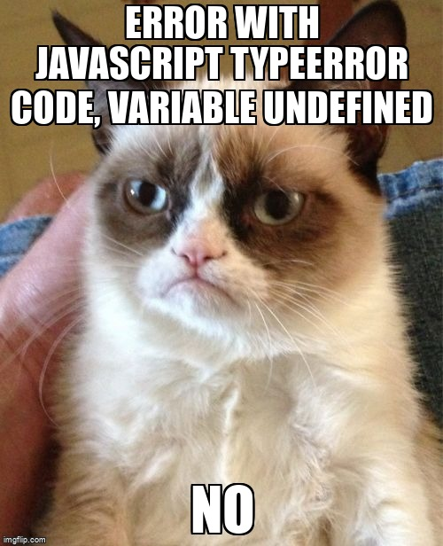

# Zastosowanie zmiennych


## Co to jest zmienna?


Zmienna jest to miejsce do przechowywania danych. Możemy używać zmiennych do przechowywania dóbr, odwiedzających i innych danych.

Aby stworzyć zmienną w JavaScript trzeba użyć słowa kluczowego jakim jest `let`.

Poniższa instrukcja tworzy (innymi słowy: deklaruje) zmienną o nazwie „label”:

```js
let label;
```

Teraz możemy umieścić w niej dane, używając operatora przypisania `=`:

```js
let label;
label = 'Surprise!'; // przechowuje ciąg znaków 'Surprise!' w zmiennej o nazwie label
```

Ciąg znaków jest teraz zapisany w obszarze pamięci skojarzonym ze zmienną. Możemy go użyć, odwołując się do nazwy zmiennej:

```js
let label;
label = 'Surprise!';

alert(label); // pokazuje zawartość zmiennej
```

Dla jasności możemy połączyć deklarację zmiennej i przypisanie jej w jednej linii:

```js
let label = 'Surprise!'; // definiuje zmienną i przypisuje wartość

alert(label); // Surprise!
```

Możemy również zadeklarować wiele zmiennych w jednej linii:

```js
let user = 'Mary', age = 25, message = 'Hello';
```

Może się to wydawać krótsze, ale nie zaleca się tego sposobu. Dla lepszej czytelności używaj jednej linii na zmienną.

Sposób drugi jest trochę dłuższy, ale łatwiejszy do odczytania:

```js
let user = 'John';
let age = 25;
let message = 'Hello';
```

W starszych skryptach możesz spotkać inne słowo kluczowe: `var` zamiast `let`:

```js
var label = 'Surprise';
```

Słowo kluczowe `var` działa prawie tak samo jak `let`. Również służy do deklarowania zmiennych, ale robi to w nieco inny, „stary” sposób.

Istnieją subtelne różnice między `let` a `var`. 


## Nazywanie zmiennych

W JavaScript są dwie zasady dotyczące tworzenia nazw zmiennych:

1. Nazwa może składać się jedynie z liter, cyfr oraz znaków `$` i `_`.
2. Nazwa nie może rozpoczynać się cyfrą.

Przykłady poprawnych nazw zmiennych:

```js
let userName;
let cat999;
```

Jeśli nazwa zmiennej zawiera kilka słów, zazwyczaj używa się konwencji camelCase. Oznacza to, że kolejne słowa po pierwszym zaczynają się wielką literą, na przykład `myVeryLongName`.

Dodatkowo, symbole `$` i `_` są dozwolone w nazwach zmiennych, traktowane są jak zwykłe litery bez specjalnego znaczenia.

Przykłady poprawnych nazw zmiennych:

```js
let $ = 9; // zmienna o nazwie "$"
let _ = 1; // zmienna o nazwie "_"

alert($ + _); // wynik: 10
```

Przykłady błędnych nazw zmiennych:

```js
let 9a; // nazwa nie może zaczynać się od cyfry
let my-cat; // znak '-' nie jest dozwolony w nazwach zmiennych
```

Warto zauważyć, że JavaScript rozróżnia wielkość liter, więc zmienne o nazwach `apple` i `APPLE` to dwie różne zmienne.

## Analogia z życia codziennego zmiennej

Możemy łatwo zrozumieć pojęcie „zmiennej”, jeśli wyobrazimy sobie ją jako „prezent” na dane, z unikalną etykietą na prezecie.

Na przykład zmienną z etykietą można wyobrazić sobie jako prezent oznaczoną “etykietę “ z zawartością o nazwie „niespodzianka” w środku:

Możemy włożyć dowolną wartość do prezentu.

Możemy również zmieniać ją tyle razy, ile chcemy:

```js
let label;

label = 'Surprise';

label = 'cat'; // wartość zmieniona

alert(label);
```

Gdy wartość zostanie zmieniona, stare dane są usuwane ze zmiennej:

Możemy również zadeklarować dwie zmienne i skopiować dane z jednej do drugiej.

```js
let surprise = 'Surprise cat';
let cat;

// skopiuj 'Surprise cat' z surprise do cat
doll = surprise;

// teraz dwie zmienne mają te same dane
alert(surprise); // Surprise cat!
alert(cat); // Surprise cat!
```


## Podwójne deklarowanie wywołuje błąd



Zmienna powinna być zadeklarowana tylko raz.

Powtórna deklaracja tej samej zmiennej to błąd:

```js
let label = "This";

// powtórzenie 'let' prowadzi do błędu
let label = "That"; // SyntaxError: 'label' has already been declared
```

Zatem powinniśmy deklarować zmienną raz, a następnie odnosić się do niej bez `let`.

W takich językach, raz zapisana wartość „w prezencie”, pozostaje tam na zawsze. Jeśli potrzebujemy przechować coś innego, język zmusza nas do utworzenia nowego pudełka (zadeklarowania nowej zmiennej). Nie możemy ponownie użyć starego.

## Nazwy zastrzeżone

Istnieje lista zastrzeżonych słów, które nie mogą być używane jako nazwy zmiennych, ponieważ są one używane przez sam język.

Na przykład: `let`, `class`, `return` i `function` są zastrzeżone.

Kod poniżej wywołuje błąd składni:

```js
let let = 8; // nie można nazwać zmiennej "let", błąd!
let return = 8; // także nie można nazwać jej "return", błąd!
```

## Const

<video width="100%" height="500" controls>
  <source src="/assets/PartyITAwesome.mp4" type="video/mp4">
</video>


Aby zadeklarować zmienną stałą  używamy `const` zamiast `let`:

```js
const myAwesomeParty = '17.08.2024';
```

Zmienna zadeklarowana przy użyciu `const` nazywana jest "stałą" i nie może zostać ponownie przypisana. Próba zmiany wartości spowoduje błąd:

```js
const myAwesomeParty = '17.08.2024';

myAwesomeParty = '07.06.2027'; // błąd, nie można przypisać nowej wartości do stałej!
```

Gdy programista jest pewien, że wartość zmiennej nie zmieni się, może zadeklarować ją jako stałą, używając `const`, aby zagwarantować i przekazać tę informację innym.

## Stałe zapisane wielkimi literami

Popularnym zwyczajem jest używanie stałych jako aliasów dla trudnych do zapamiętania wartości znanych przed wykonaniem programu. Takie stałe zapisuje się wielkimi literami i podkreśleniami.

Na przykład możemy zdefiniować stałe dla różnych etapów przygotowania imprezy:

```js
const STEP_INVITATIONS_SENT = "Invitations Sent";
const STEP_DECORATIONS_DONE = "Decorations Done";
const STEP_CATERING_ORDERED = "Catering Ordered";
const STEP_MUSIC_SETUP = "Music Setup Complete";

// ...kiedy monitorujemy postęp przygotowań
let currentStep = STEP_DECORATIONS_DONE;
console.log(currentStep); // Decorations Done
```

Korzyści:

- `STEP_DECORATIONS_DONE` jest bardziej zrozumiałe niż ręczne wpisywanie opisu w kodzie.
- `STEP_DECORATIONS_DONE` zmniejsza ryzyko błędów w porównaniu do użycia zwykłego tekstu.
- `STEP_DECORATIONS_DONE` jest bardziej znaczące, co ułatwia czytanie i zrozumienie kodu.

Jeśli chodzi o nazewnictwo stałych, warto wiedzieć, kiedy używać wielkich liter, a kiedy nadawać im zwykłe nazwy.

Stała oznacza, że wartość zmiennej pozostaje niezmienna. Niektóre stałe są ustalone z góry, na przykład etapy przygotowania imprezy, podczas gdy inne mogą być ustalane w trakcie, ale nie zmieniają się po przypisaniu.

Na przykład:

```js
const guestsArrivedAt = new Date(); // czas, kiedy goście przybyli
```

Wartość `guestsArrivedAt` jest ustalana dopiero w trakcie trwania imprezy, więc jej nazwa używa małych liter. Jednak nadal jest to stała, ponieważ po ustaleniu czasu, nie ulega ona zmianie.

Stałe zapisane wielkimi literami stosuje się zazwyczaj do wartości, które są znane i ustalone wcześniej, jak etapy przygotowań do imprezy.

## Nadawanie dobrych nazw

Nadawanie odpowiednich nazw zmiennym jest kluczowe, zwłaszcza podczas planowania imprezy. Nazwa zmiennej powinna jasno i precyzyjnie odzwierciedlać to, jakie dane przechowuje. Umiejętność tworzenia dobrych nazw zmiennych jest jedną z najważniejszych w programowaniu.

Nazwy zmiennych powinny być:

- **Zrozumiałe dla innych**: Na przykład, zamiast używać ogólników, takich jak `a` czy `b`, lepiej użyć nazw, które oddają kontekst, jak `guestList` czy `partyTheme`.

- **Bez skrótów**: Unikaj skracania nazw, takich jak `gL` dla `guestList`, chyba że jest to absolutnie konieczne i wszyscy w zespole rozumieją ten skrót.

- **Maksymalnie opisowe i zwięzłe**: Nazwy takie jak `drinks` lub `decorations` są o wiele lepsze niż niejasne `items` czy `stuff`, ponieważ dokładniej opisują, co jest przechowywane w zmiennej.

- **Spójne**: Jeśli nazwiesz listę gości `guestList`, to inne zmienne związane z gośćmi powinny mieć podobne nazwy, takie jak `confirmedGuests` czy `vipGuests`, a nie np. `attendeesList` czy `specialInvitees`. Taka spójność ułatwia zrozumienie kodu.

Przykład złej praktyki:

```js
let g = ["Alice", "Bob", "Charlie"]; // "g" nie mówi jasno, że to lista gości
let theme = "Hawaiian"; // lepiej niż "t", ale nadal zbyt ogólne
```

Przykład dobrej praktyki:

```js
let guestList = ["Alice", "Bob", "Charlie"]; // jasne i zrozumiałe
let partyTheme = "Hawaiian"; // od razu wiadomo, że chodzi o temat imprezy
```

Poprawne nazewnictwo zmiennych sprawia, że kod jest bardziej czytelny i zrozumiały, zarówno dla ciebie, jak i dla innych, którzy mogą go później przeglądać lub edytować.

## Podsumowanie

Możemy tworzyć zmienne do przechowywania danych, używając słów kluczowych `var`, `let` lub `const`.

- `let` – to nowoczesny sposób na tworzenie zmiennych.
- `var` – to stara metoda, z którą możemy się spotkać w starszych skryptach.
- `const` – działa podobnie jak `let`, ale wartość zmiennej nie może być zmieniona po jej ustaleniu.

Teraz zmiennych powinny być jasne i łatwe do zrozumienia, aby od razu było wiadomo, co przechowują.

## Finish

### Teraz już wiesz wszytko o zmiennych. 

## "It's a piece of cake for you!" 


