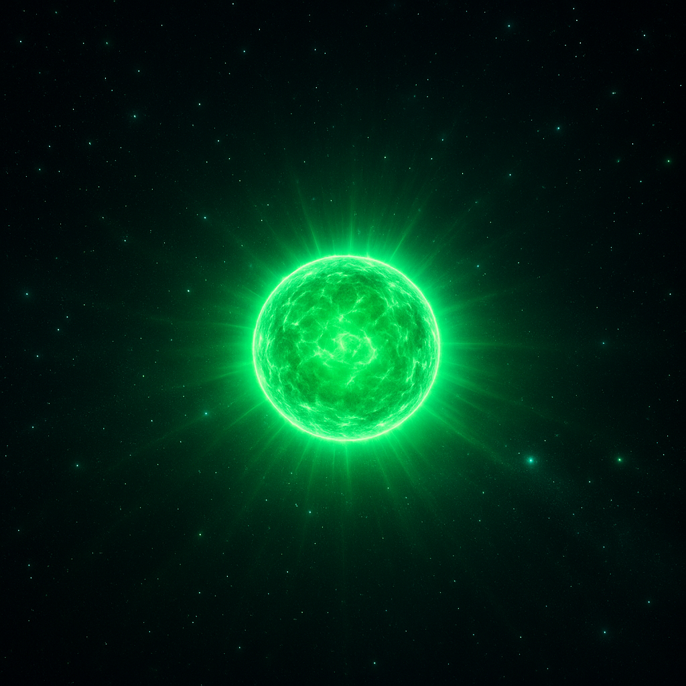

# Super Nova 

isn’t just another pretty visual — it’s an exploding star driven by shaders, bloom, and post-processing. This project was born from a desire to explore light effects in Three.js and get hands-on with WebGL magic.

## 🌠 Project Goal



I wanted more than just a glowing sphere. My goals were:

- Learn how **GLSL shaders** work in a real-world project.
- Create dynamic visual effects using **Three.js**.
- Experiment with **UnrealBloomPass** and post-processing.
- Make it interactive: a user click triggers the "supernova" explosion.

---

## 🧪 Shaders: Where Math Meets Light

A shader is a small program that runs on the GPU. This project uses two types:

### Vertex Shader

Controls the position of geometry. In this case, it's fairly basic:

```glsl
void main() {
  gl_Position = projectionMatrix * modelViewMatrix * vec4(position, 1.0);
}
```

### Fragment Shader

This is where the glow and magic happen — pulsating rings, gradients, and animated flickers. The glowing effect is built using sin, the radius r, angle, and time (u_time):

```glsl
float wave = sin(10.0 * r - u_time * 4.0 + angle * 4.0);
float ring = smoothstep(0.01, 0.02, wave * 0.05 + 0.3 - r);
vec3 color = u_color * ring;
gl_FragColor = vec4(color, 1.0);
```

### Why use this?

Animated, flowing energy rings.

Pulsating motion — like the star is about to explode.

Fully procedural — no textures involved.


### 💥 UnrealBloomPass — Controlled Overexposure

A major feature of this project is the UnrealBloomPass from three/examples/jsm/postprocessing. It adds a layer of post-processing glow:

- Light bleeds beyond object edges.

- Creates natural-looking “overexposed” effects.

- Adds drama to the entire scene.

```js
const bloomPass = new UnrealBloomPass(
  new THREE.Vector2(window.innerWidth, window.innerHeight),
  3.0, // strength
  0.7, // radius
  0.1  // threshold
);
```
### 👉 These values control intensity, softness, and threshold. Paired with the shader, it creates a massive burst of light when activated.

### 🔘 Interactivity — A Starburst on Click

When the user clicks the glowing sphere:

1.Color transition begins.

2.emissiveIntensity increases.

3.The sphere scales up.

4.The bloom pass intensifies the glow.


```js
sphere.material.color.lerpColors(originalColor, clickedColor, t);
sphere.material.emissiveIntensity = 2.5 + 2.5 * t;
sphere.scale.setScalar(1 + t);
```
The animation uses sinusoidal easeOut for smooth transitions.

### ⚛️ BufferGeometry – 500 Particles, Zero Lag

Instead of spawning 500 objects, I use BufferGeometry to render a single, efficient point cloud:

```js
const geometry = new THREE.BufferGeometry();
const positions = new Float32Array(500 * 3);
// Random XYZ positions
for (let i = 0; i < 500 * 3; i++) {
  positions[i] = (Math.random() - 0.5) * 10;
}
geometry.setAttribute("position", new THREE.BufferAttribute(positions, 3));
```
### 🎛️ Post-Processing with EffectComposer

This project uses a basic post-processing chain via EffectComposer:

```js
const composer = new EffectComposer(renderer);
composer.addPass(new RenderPass(scene, camera));
composer.addPass(bloomPass);
```
This lets you apply advanced effects like bloom without modifying the raw render pipeline.

### Project Structure

```
📁 super-nova/
├── index.js             # Scene, camera, click logic
├── shaders/
│   ├── vertex.glsl      # Simple vertex shader
│   └── fragment.glsl    # Light effects and animation
├── bloomEffect.js       # UnrealBloomPass setup
└── styles.css           # Dark background + reset
```

### 🧠 What You'll Learn from This Project

- How to write custom shaders in GLSL.

- How the bloom effect works and how to tune it.

- How to optimize performance with BufferGeometry.

- How to use EffectComposer and post-processing in Three.js.

- How to create interactive 3D visuals that respond to user input.


### 👩‍🚀 Who It's For

Frontend developers and WebGL explorers looking to go beyond BoxGeometry and HDRI backgrounds. This project is an awesome introduction to writing shaders and building reactive, glowing 3D effects.


### 📸 Demo / Preview

👉 View the project on GitHub

```
git@github.com:natalia-kuchta/super-nova.git
```


