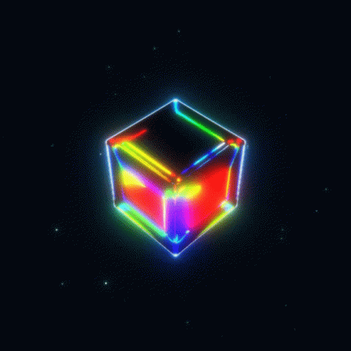
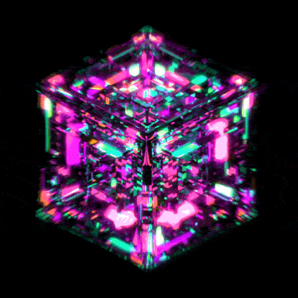

# Three.js 

**Odyssey into the Cosmic Geometry**

Hey there, code gang! Ready to dive into the 3D cosmos and feel like you're coding the universe from your very own desk? Are you prepared for a virtual journey through the galaxy of triangles, squares, and other geometric wonders? Today, I'll show you how to jump into the world of **Three.js** – yes, that framework that gives you the power to build anything your nerdy soul can dream up!


### What is this Three.js thing anyway?

**Three.js** is a tool that lets you work wonders in the browser. We're talking about 3D graphics, rendered in real-time. Imagine – you’re building planets, spaceships, geometric figures, or maybe even your very own 3D capybara model! You won’t need to fire up Photoshop or Blender – everything happens directly in your code.

###  We have two options to start our cosmic odyssey with Three.js


### 1. Three.js via npm

Ahoy, code traveler! 🌍 If you want to embark on a journey to the land of code, you first need a few magical artifacts. Here’s what you need to do:

1. **Install Node.js** – it’s like your digital rocket fuel. Without it, you won’t be able to start your journey or your build!
2. **Install three.js and Vite** – your new adventure buddies! Vite is a build tool that will be your loyal companion during the development of your project. You need to install it in the terminal in your project folder. Vite will work in the background like an invisible helper but won’t appear on the final webpage. Prefer another build tool? No problem! We support modern tools that can import ES Modules, like a magical wand!

```bash

  # three.js - adding our magical library
  npm install --save three

  # vite - our builder
  npm install --save-dev vite

```

After installation, your project will have new mysterious items – the `node_modules/` folder and `package.json` file. What are these artifacts? They’re like your gear and map on this coding adventure!

1. **Run Vite** – type the magical incantation in your terminal:

```bash

   npx vite

```

What is npx? It’s your key to unlocking hidden doors in the digital world!

If everything went according to plan, a magical URL, like `http://localhost:5173`, will appear in your terminal. Click on this link, and you’ll see your webpage in all its glory!

### 2. Import via CDN

Let’s start like a true coder. We need to grab our rocket – I mean, Three.js – and add it to the project. Where from? From the mysterious depths of the CDN.

Imagine you're a coding nomad, trekking through the digital wilderness with a backpack full of bits and bytes. Your mission? Make the browser finally understand what to do with that “three” package you threw its way in the `main.js` file. But, alas! Browsers aren’t that sharp. When they see something like `import from 'three'`, they scratch their heads and ask, “What’s that supposed to mean?”

So, dear nomad, you need a map! Import maps are your survival tool. You need to place it in the sacred `<head>` of your `index.html` file. Drop this piece of code right after the styles, because without the map, you’re lost:

```html

   <script type="importmap">
     {
       "imports": {
         "three": "https://cdn.jsdelivr.net/npm/three@<version>/build/three.module.js",
         "three/addons/": "https://cdn.jsdelivr.net/npm/three@<version>/examples/jsm/"
       }
     }
   </script>

```

Just don’t forget to replace `<version>` with something specific, like “v0.149.0”. You can find the latest version, like a true explorer, on npm!

Now for the next challenge. Browsers aren’t keen on you just throwing HTML files at them. They need a server. A local server, like a digital campfire, where all those files can warm up. Simply install Node.js (that’s your fuel) and run the command:

```bash

  npx serve .

```

If the universe aligns, you’ll see something like `http://localhost:3000` appear in your terminal. That’s your new digital path leading to… emptiness! Yes, the page will be blank, but don’t worry. It’s just the beginning of your adventure — scenes are waiting for you to create.

Now you can forge ahead, creating wonders, and remember: without a local server, there’s no digital magic!

**Project Structure**

Welcome to the next phase of your coding expedition! 🗺️ It’s time to stock up your gear and prep your treasures for transport. Here’s how to set everything up for a successful adventure:

**index.html**

This is your digital treasure map, guiding the browser to where your code gold is hidden. Check out what it should look like:

```html

   <!DOCTYPE html>
   <html lang="en">
       <head>
           <meta charset="utf-8">
           <title>My first three.js app</title>
           <style>
               body { margin: 0; }
           </style>
       </head>
       <body>
           <script type="module" src="/main.js"></script>
       </body>
   </html>

```

**main.js**

Here’s where you keep your spells and magical potions. This file holds all the three.js secrets that will bring your page to life. Here’s a snippet:

```js

    import * as THREE from 'three';

```

**public/**

Now, let’s dive into `public/`, your digital treasure chest! Also known as the "static" folder, it’s where you store unchanging assets: textures, sounds, and 3D models. These precious items are delivered to the site just as they are—like magical artifacts hidden in a digital vault.

With all this setup, you’re ready to continue your journey—time to create, discover, and explore. 🚀✨

## **What’s Next?**


**Creating Scene, Camera, and Renderer**

Your interstellar toolkit is almost ready! 🌌 Since we're all set to dive into the 3D universe, it's time to set up the scene, camera, and rendering.

**Scene, Camera, and Renderer—The Holy Trinity**

First rule of the 3D universe: you need a scene. Second rule: without a camera, you see nothing. Third rule: the renderer is the wizard that extracts graphics and beams them to your screen.

```js

   const scene = new THREE.Scene();
   const camera = new THREE.PerspectiveCamera(75, window.innerWidth / window.innerHeight, 0.1, 1000);
   const renderer = new THREE.WebGLRenderer();
   renderer.setSize(window.innerWidth, window.innerHeight);
   document.body.appendChild(renderer.domElement);

```

Told you it’s going to be cosmic! The camera is your eyes, the scene is the space around you, and the renderer is the guy showing you what you’ve created.

1. **Geometric Hit of the Day: The Cube**

   Time to introduce our **star of the evening**—the beautiful, classic, reliable **cube**. Who wouldn’t want a cube of their own in their browser?

 ```js
    
    const geometry = new THREE.BoxGeometry(1, 1, 1);
    const material = new THREE.MeshBasicMaterial({ color: '#fe019a'});
    const cube = new THREE.Mesh(geometry, material);
    scene.add(cube);
    
 ```

   Here’s your pink **cube**. It's pink, just like the glasses through which you see the code. But we’re not stopping here—onward and upward!

2. **Bring the Cube to Life!**

   We know it’s 3D, but why not add a bit of life? Let’s make that cube spin like it’s at a rave party!

```js
    
    function animate(){
        cube.rotation.x += 0.02;
        cube.rotation.y += 0.02;
        renderer.render(scene,camera);
    }
    renderer.setAnimationLoop(animate);
```

   Now our cube is spinning like a DJ at an afterparty. You might want to ask Alexa to play "Stayin' Alive" Bee Gees because this cube just started its dance of a lifetime.

   


3. **Don’t Forget the Camera!**

   **Adjust the Camera**

   The camera needs to be in the perfect spot to capture the whole view.

 ```js
    
    camera.position.z = 5;
    
```

   And there you have it! Your cube is spinning like a celestial marvel. It’s like a galactic Rubik’s Cube, but without the hassle of solving it.


---

<video width="100%" height="500" controls>
  <source src="/assets/pink-cube-rotation.mp4" type="video/mp4">
</video>

## Awesome!


Alright, now you’ve got a green spinning cube, but this is just the beginning of your Three.js odyssey. You can create more geometric shapes, change colors, add lights and shadows—and maybe even design that dream capybara model for your own HTTP server.

Three.js is like an open galactic space for your 3D graphic dreams. You’ve got the power—now it’s up to you to decide what to do with it. So grab that keyboard and **let’s go full cosmic**!

Cosmic coding, programming astronaut! 🚀✨

