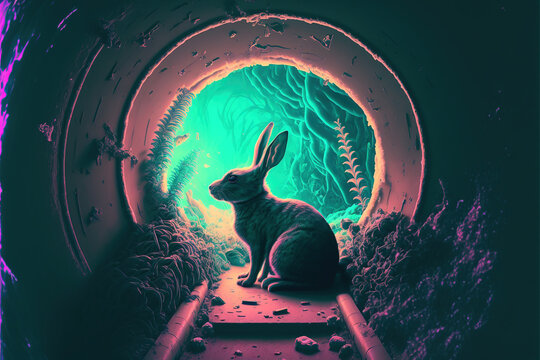
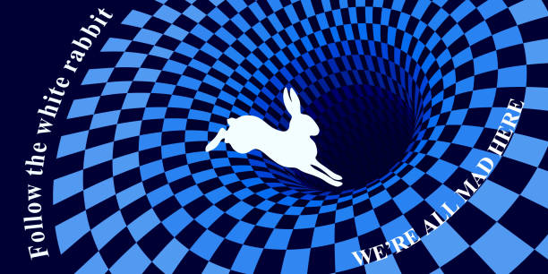

# Rabbit Hole

**Raising in the Graphic Environment: From Unixporn to I3, BSPWM, and Rabbit Hole**

Hello, graphic environment enthusiasts and code seekers! Today, we're taking you on a journey through the fascinating world of raising, the magical process of customizing your graphic environment to perfection. Get ready to dive into a realm where every pixel matters and every line of code is a step towards greatness.

### **What is Raising?**

Raising is the art of tailoring your graphic environment to a level that could be described as "your personal heaven on screen." It's more than just changing wallpapers or rearranging icons; it's a transformation that requires more than basic HTML skills.

### **Graphic Environments: Who Rules the Roost?**

Let's start by diving into the world of graphic environments, where the options are almost limitless. From classic GNOME and KDE to minimalist Xfce and LXQt, the possibilities are endless until you fall into the so-called **"rabbit hole"** — the abyss of choice. The rabbit hole is where one change leads to another, and every decision brings new, exciting options. It's like exploring a never-ending maze, except instead of a Minotaur, you encounter piles of documentation and internet forums.

### **Unixporn: Graffiti for Geeks**

Now it's time to check out the brave souls who decided to share their epic creations with the world. **Unixporn** is where nerds from around the globe showcase their most stunning graphic environment configurations. You can see everything – from minimalist monochrome solutions to truly wild, colorful whirlwinds that could have been inspired by an abstract painter. It’s like browsing an art gallery, but with a terminal taking center stage.

### **I3 and BSPWM: The Kings of Minimalism**

Finally, let’s talk about the heavyweights of window management: **I3** and **BSPWM**. Both are minimalist window managers that make managing workspace feel like building with LEGO blocks.

- **I3** is like the most "organized" version of your desk. It’s functional, efficient, and sleek. It’s the ideal choice if you like to have everything under control and don’t want your windows dancing across the screen like in a celebrity dance-off.
- **BSPWM**, on the other hand, is the "wilder" cousin of I3. It offers even greater freedom and flexibility in window management, making you feel like a master of organization who has just earned the title of the best architect of virtual space.

### **The World Beyond**

And now maybe you’re interested in creating your own graphic environment that’s truly a work of art? Perhaps you dream of a setup that turns your everyday life into something extraordinary? Remember, raising is not just about playing with code and configurations, but also an art form of expressing yourself through digital space.

So, take your favorite graphic environment, dive into the rabbit hole, explore Unixporn, and dare to create something that reflects your boldest technical dreams. After all, everyone deserves their own perfect graphic environment – full of icons, descriptions, JPGs, and unforgettable buttons!

### Attention! You might not escape the rabbit hole like Alice in Wonderland. Are you willing to risk it? Jump in…

